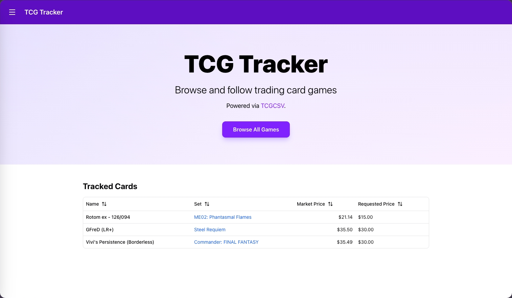

# TCG Tracker

This is a React application that wraps the [TCGCSV](https://tcgcsv.com) data that allows me to browse its data and be able to track individual products. This also has an integration with a Discord Webhook that I can get alerts if a product is under a price I input that I am willing to purchase it for.

## Getting Started

First install the node modules with `npm install`.

If you wish to run a self-hosted Convex backend, run the docker compose file in the `convex-backend` folder.

Examine the .env.example file for the environment vars that I use. The env vars may differ if you use the Convex hosted platform vs self hosting it.

Then run both `npx convex dev` for the Convex dev server and `npm run dev` to spin up the React app.

To do all three of these at once, I have a [Zellij](https://zellij.dev/) layout that can be run via `npm run zellij` (make sure Zellij is installed first)

Also deploy a [Discord webhook url](https://support.discord.com/hc/en-us/articles/228383668-Intro-to-Webhooks) via either the Convex dashboard or cli with the key of `DISCORD_WEBHOOK_URL`.

## Building For Production

To build this application for production, run `npm run build` and it will generate a `.output` folder to be deployed.

Then when running the app, set the `CONVEX_URL` and `CONVEX_SITE_URL` env variables to point to Convex (No `VITE_` prefix as that would require the vars to be set at build time while this allows them to be set at runtime).

> **Note**: As of right now there is no auth layer for convex, but I have deployed this via my internal network so I did not need any for now. If you wish to deploy this app to the public internet, you probably may want to have an auth layer / rate limiting such that Convex is not sent a huge amount of requests by a malicious actor.
